# Chat Context & Smart Provider Selection — Implementation Plan

## Problem

The current RAG API is **stateless** — each `/ask` request is independent. This causes:
1. No provider selection UI support
2. No conversation history — LLM has no memory of prior turns
3. No smart provider inference from context

---

## Architecture Overview

```mermaid
graph LR
    A["📱 Frontend<br/>(iOS Swift)"] -->|HTTP| B["🔧 Backend<br/>(Go API)"]
    B -->|HTTP| C["🧠 RAG<br/>(Python FastAPI)"]
    C -->|Query| D["📦 ChromaDB"]
    C -->|Prompt| E["🤖 LLM"]
```



> [!IMPORTANT]
> Each layer has distinct responsibilities. The Backend acts as a **proxy + session manager**, the RAG handles **retrieval + LLM logic**, and the Frontend handles **UI + session lifecycle**.

---

## 🧠 RAG End (Python `main.py`) — TODO

> The RAG layer focuses on **retrieval, prompt engineering, and LLM interaction**. It is stateless — all session/context is passed in per request.

### Phase 1: New Endpoints

- [ ] **`GET /providers`** — Query ChromaDB for distinct `provider` metadata values, return list with display names
  ```json
  {"providers": [
    {"id": "bluecross", "name": "Blue Cross 藍十字"},
    {"id": "one_degree", "name": "OneDegree"},
    {"id": "prudential", "name": "Prudential 保誠"}
  ]}
  ```

- [ ] **Modify `POST /ask`** — Accept two new optional fields:
  ```python
  class QueryRequest(BaseModel):
      query: str
      provider: str = None       # Explicit provider filter
      session_id: str = None     # Session ID (passed through from backend)
      chat_history: list = None  # Last N turns [{"role":"user","content":"..."}, ...]
  ```

### Phase 2: Prompt Enhancement

- [ ] **Update prompt template** — Add `{chat_history}` and `{active_provider_name}` sections:
  ```
  ### Provider Context
  The user is currently viewing: {active_provider_name}

  ### Conversation History
  {chat_history}

  ### Retrieved Context
  {context}

  ### User Question
  {question}
  ```

- [ ] **Build `format_chat_history()`** — Format last 5 turns as `User: ... / Assistant: ...`, truncate answers to 300 chars

- [ ] **Add provider inference prompt rule** — If no provider is active and the question seems provider-specific, tell the user which providers are available and suggest selecting one

### Phase 3: Response Enhancement

- [ ] **Update `QueryResponse`** — Add `active_provider` and `session_id` to response:
  ```python
  class QueryResponse(BaseModel):
      answer: str
      sources: list[str]
      active_provider: str = None   # Which provider was used for filtering
      session_id: str = None        # Echo back for frontend tracking
  ```

### RAG Summary

| File | Changes |
|---|---|
| `main.py` | Add `/providers` endpoint, modify `/ask` request/response models, update prompt template, add `format_chat_history()` |
| `ingest.py` | No changes needed |

---

## 🔧 Backend End (Go API) — TODO

> The Backend is the **session manager and proxy layer**. It owns session state and conversation history, then passes context to the RAG on each call.

### Phase 1: Session Management

- [ ] **Add session store** — In-memory map `map[string]*Session` with TTL (30-min expiry):
  ```go
  type Session struct {
      ID               string
      SelectedProvider string          // "" = all providers
      ChatHistory      []ChatTurn      // [{Role, Content}, ...]
      LastActivity     time.Time
      LastMentionedProvider string     // For smart inference
  }
  ```

- [ ] **`POST /api/chat/session`** — Create a new session, return `{ session_id }`

- [ ] **`POST /api/chat/session/{id}/provider`** — Set/change the active provider for a session. Clear chat history on provider change to avoid cross-provider confusion

- [ ] **`GET /api/chat/providers`** — Proxy to RAG's `GET /providers`, cache the result

### Phase 2: Proxy `/ask` with Context

- [ ] **`POST /api/chat/ask`** — The main chat endpoint:
  1. Receive `{ session_id, query }` from frontend
  2. Load session → get `selected_provider`, `chat_history`, `last_mentioned_provider`
  3. **Resolve provider** using priority chain:
     ```
     Priority 1: session.SelectedProvider (user chose via UI)
     Priority 2: Detect provider keyword in query
     Priority 3: session.LastMentionedProvider (from prior turns)
     Priority 4: nil → search all providers
     ```
  4. Forward to RAG: `POST /ask { query, provider, session_id, chat_history (last 5 turns) }`
  5. Save the turn (user query + LLM answer) to `session.ChatHistory`
  6. If a provider was detected in the query, update `session.LastMentionedProvider`
  7. Return response to frontend with `active_provider`

- [ ] **Provider keyword detection** — Utility function:
  ```go
  func detectProvider(query string) string {
      lower := strings.ToLower(query)
      switch {
      case contains(lower, "blue cross", "bluecross", "藍十字"): return "bluecross"
      case contains(lower, "one degree", "onedegree"):           return "one_degree"
      case contains(lower, "prudential", "pruchoice", "保誠"):   return "prudential"
      case contains(lower, "bolttech"):                          return "bolttech"
      default: return ""
      }
  }
  ```

### Phase 3: Session Cleanup

- [ ] **Background goroutine** — Every 5 minutes, sweep expired sessions (idle > 30 min)

### Backend Summary

| File | Changes |
|---|---|
| `internal/chat/session.go` | `Session` struct, in-memory store, TTL cleanup |
| `internal/chat/handler.go` | HTTP handlers for `/session`, `/session/{id}/provider`, `/ask` |
| `internal/chat/provider.go` | Provider detection + resolution logic |
| `cmd/server/main.go` | Register new chat routes |

---

## 📱 Frontend End (iOS Swift) — TODO

> The Frontend manages the **UI and session lifecycle**. It creates sessions, lets users pick providers, and sends queries with session IDs.

### Phase 1: Provider Selection UI

- [ ] **Provider selection chips/buttons** — Show at the top of the chat view (or in a sheet):
  - Fetch from `GET /api/chat/providers` on view appear
  - Options: "All Providers" (default), "Blue Cross", "OneDegree", "Prudential", etc.
  - Tapping a chip → calls `POST /api/chat/session/{id}/provider`
  - Selected chip shows highlighted state

- [ ] **Session lifecycle** — Create a session `onAppear`:
  ```swift
  // On chat view appear
  let session = await api.createSession() // POST /api/chat/session
  self.sessionId = session.id
  ```
  
### Phase 2: Chat with Context

- [ ] **Send `session_id` with every query**:
  ```swift
  let response = await api.ask(
      query: userMessage,
      sessionId: self.sessionId
  )
  ```
  - No need to manage chat history on the frontend — the Backend handles it

- [ ] **Display active provider indicator** — Show a badge/label from `response.active_provider`:
  - e.g., "🔍 Answering based on: **Prudential**" above the response bubble

### Phase 3: Smart Inference UI Feedback

- [ ] **Show provider context** — When `active_provider` comes back in the response, show which provider the system is using
- [ ] **Provider switch indicator** — If the user mentions a different provider mid-conversation, show a subtle notification: "Switched to Blue Cross context"

### Frontend Summary

| File | Changes |
|---|---|
| `RAGChatView.swift` | Add provider chips, session management, active provider display |
| `InsuranceAPIService.swift` | Add `createSession()`, `selectProvider()`, update `askQuestion()` to include `sessionId` |

---

## Data Flow Diagrams

### Normal Query (Provider Pre-Selected)


### Follow-up Query (Smart Inference)

```mermaid
sequenceDiagram
    participant F as 📱 Frontend
    participant B as 🔧 Backend (Go)
    participant R as 🧠 RAG (Python)

    Note over F: User already asked about Prudential in Turn 1

    F->>B: POST /api/chat/ask { session_id, "What is the waiting period?" }
    B->>B: No provider in query, no UI selection
    B->>B: ✅ session.LastMentionedProvider = "prudential"
    B->>R: POST /ask { query, provider:"prudential", chat_history:[Turn1] }
    R-->>B: { answer about Prudential waiting period }
    B-->>F: { answer, active_provider:"prudential" }
```



---

## Implementation Order

| Priority | Task | Owner | Depends On |
|---|---|---|---|
| 1 | `GET /providers` endpoint | 🧠 RAG | — |
| 2 | `POST /ask` accept `chat_history` + `session_id` | 🧠 RAG | — |
| 3 | Update prompt template | 🧠 RAG | #2 |
| 4 | Update `QueryResponse` model | 🧠 RAG | — |
| 5 | Session store + CRUD endpoints | 🔧 Backend | #1 |
| 6 | Proxy `/ask` with context injection | 🔧 Backend | #2, #5 |
| 7 | Provider resolution logic | 🔧 Backend | #6 |
| 8 | Provider selection UI | 📱 Frontend | #5 |
| 9 | Chat with `session_id` | 📱 Frontend | #6 |
| 10 | Active provider indicator | 📱 Frontend | #7 |

> [!TIP]
> **Start with RAG (#1-4)** since both Backend and Frontend depend on it. Backend (#5-7) and Frontend (#8-10) can then be developed in parallel.

---

## Verification Plan

### Per-Layer Tests

| Layer | Test | Method |
|---|---|---|
| 🧠 RAG | `/providers` returns all 3 providers | `curl GET /providers` |
| 🧠 RAG | `/ask` with `chat_history` produces context-aware answer | `curl POST /ask` with history |
| 🔧 Backend | Session CRUD works (create, select provider, expire) | `curl` + wait 30min |
| 🔧 Backend | Provider priority chain resolves correctly | Unit test `resolveProvider()` |
| 📱 Frontend | Provider chips render and toggle | Manual UI test |
| 📱 Frontend | Follow-up questions maintain provider context | Manual conversation test |

### End-to-End Test

1. Open chat → provider chips load
2. Select "Prudential" → chip highlights
3. Ask "What are the age requirements?" → Answer references Prudential, sources show `prudential.md`
4. Ask "What about the waiting period?" (no provider mentioned) → Still answers about Prudential
5. Ask "How does Blue Cross compare?" → Switches context to Blue Cross
6. Ask "And the coverage limit?" → Still about Blue Cross (inferred from Turn 5)
